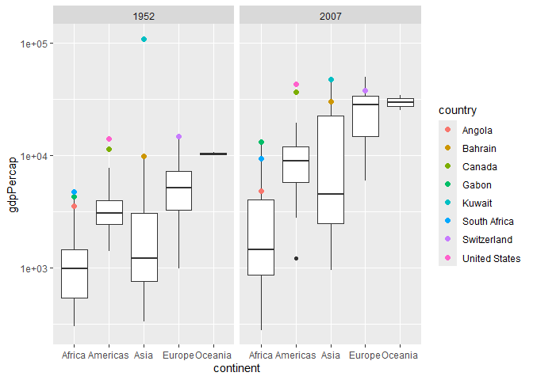
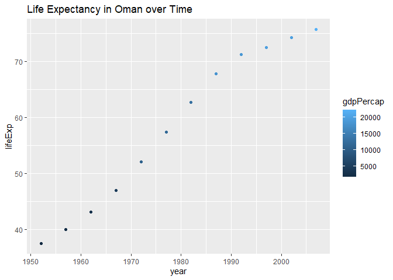
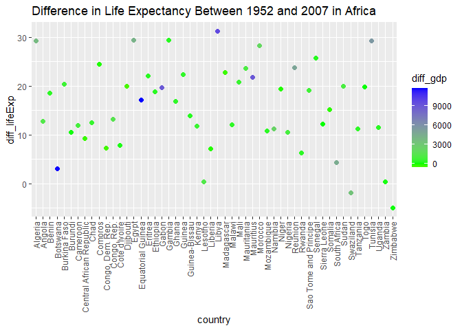
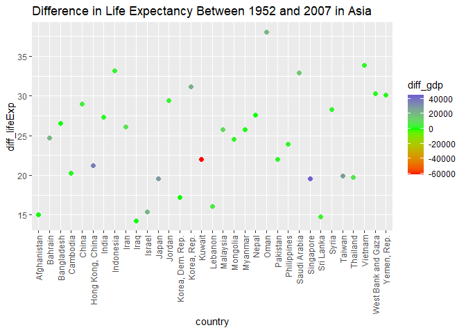
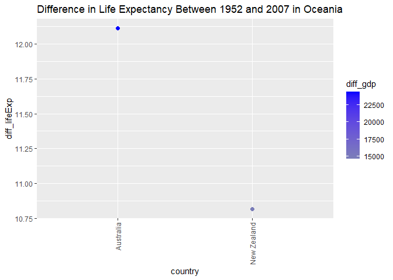

Gapminder
================
Isa de Luis
2025-12-02

- [Grading Rubric](#grading-rubric)
  - [Individual](#individual)
  - [Submission](#submission)
- [Guided EDA](#guided-eda)
  - [**q0** Perform your “first checks” on the dataset. What variables
    are in
    this](#q0-perform-your-first-checks-on-the-dataset-what-variables-are-in-this)
  - [**q1** Determine the most and least recent years in the `gapminder`
    dataset.](#q1-determine-the-most-and-least-recent-years-in-the-gapminder-dataset)
  - [**q2** Filter on years matching `year_min`, and make a plot of the
    GDP per capita against continent. Choose an appropriate `geom_` to
    visualize the data. What observations can you
    make?](#q2-filter-on-years-matching-year_min-and-make-a-plot-of-the-gdp-per-capita-against-continent-choose-an-appropriate-geom_-to-visualize-the-data-what-observations-can-you-make)
  - [**q3** You should have found *at least* three outliers in q2 (but
    possibly many more!). Identify those outliers (figure out which
    countries they
    are).](#q3-you-should-have-found-at-least-three-outliers-in-q2-but-possibly-many-more-identify-those-outliers-figure-out-which-countries-they-are)
  - [**q4** Create a plot similar to yours from q2 studying both
    `year_min` and `year_max`. Find a way to highlight the outliers from
    q3 on your plot *in a way that lets you identify which country is
    which*. Compare the patterns between `year_min` and
    `year_max`.](#q4-create-a-plot-similar-to-yours-from-q2-studying-both-year_min-and-year_max-find-a-way-to-highlight-the-outliers-from-q3-on-your-plot-in-a-way-that-lets-you-identify-which-country-is-which-compare-the-patterns-between-year_min-and-year_max)
- [Your Own EDA](#your-own-eda)
  - [**q5** Create *at least* three new figures below. With each figure,
    try to pose new questions about the
    data.](#q5-create-at-least-three-new-figures-below-with-each-figure-try-to-pose-new-questions-about-the-data)

*Purpose*: Learning to do EDA well takes practice! In this challenge
you’ll further practice EDA by first completing a guided exploration,
then by conducting your own investigation. This challenge will also give
you a chance to use the wide variety of visual tools we’ve been
learning.

<!-- include-rubric -->

# Grading Rubric

<!-- -------------------------------------------------- -->

Unlike exercises, **challenges will be graded**. The following rubrics
define how you will be graded, both on an individual and team basis.

## Individual

<!-- ------------------------- -->

| Category | Needs Improvement | Satisfactory |
|----|----|----|
| Effort | Some task **q**’s left unattempted | All task **q**’s attempted |
| Observed | Did not document observations, or observations incorrect | Documented correct observations based on analysis |
| Supported | Some observations not clearly supported by analysis | All observations clearly supported by analysis (table, graph, etc.) |
| Assessed | Observations include claims not supported by the data, or reflect a level of certainty not warranted by the data | Observations are appropriately qualified by the quality & relevance of the data and (in)conclusiveness of the support |
| Specified | Uses the phrase “more data are necessary” without clarification | Any statement that “more data are necessary” specifies which *specific* data are needed to answer what *specific* question |
| Code Styled | Violations of the [style guide](https://style.tidyverse.org/) hinder readability | Code sufficiently close to the [style guide](https://style.tidyverse.org/) |

## Submission

<!-- ------------------------- -->

Make sure to commit both the challenge report (`report.md` file) and
supporting files (`report_files/` folder) when you are done! Then submit
a link to Canvas. **Your Challenge submission is not complete without
all files uploaded to GitHub.**

``` r
library(tidyverse)
```

    ## Warning: package 'tidyverse' was built under R version 4.3.3

    ## Warning: package 'ggplot2' was built under R version 4.3.3

    ## Warning: package 'tidyr' was built under R version 4.3.3

    ## Warning: package 'purrr' was built under R version 4.3.3

    ## Warning: package 'lubridate' was built under R version 4.3.3

    ## ── Attaching core tidyverse packages ──────────────────────── tidyverse 2.0.0 ──
    ## ✔ dplyr     1.1.4     ✔ readr     2.1.5
    ## ✔ forcats   1.0.0     ✔ stringr   1.5.1
    ## ✔ ggplot2   3.5.1     ✔ tibble    3.2.1
    ## ✔ lubridate 1.9.4     ✔ tidyr     1.3.1
    ## ✔ purrr     1.0.4     
    ## ── Conflicts ────────────────────────────────────────── tidyverse_conflicts() ──
    ## ✖ dplyr::filter() masks stats::filter()
    ## ✖ dplyr::lag()    masks stats::lag()
    ## ℹ Use the conflicted package (<http://conflicted.r-lib.org/>) to force all conflicts to become errors

``` r
library(gapminder)
```

    ## Warning: package 'gapminder' was built under R version 4.3.3

*Background*: [Gapminder](https://www.gapminder.org/about-gapminder/) is
an independent organization that seeks to educate people about the state
of the world. They seek to counteract the worldview constructed by a
hype-driven media cycle, and promote a “fact-based worldview” by
focusing on data. The dataset we’ll study in this challenge is from
Gapminder.

# Guided EDA

<!-- -------------------------------------------------- -->

First, we’ll go through a round of *guided EDA*. Try to pay attention to
the high-level process we’re going through—after this guided round
you’ll be responsible for doing another cycle of EDA on your own!

### **q0** Perform your “first checks” on the dataset. What variables are in this

dataset?

``` r
## TASK: Do your "first checks" here!
?gapminder
```

    ## starting httpd help server ... done

``` r
summary(gapminder)
```

    ##         country        continent        year         lifeExp     
    ##  Afghanistan:  12   Africa  :624   Min.   :1952   Min.   :23.60  
    ##  Albania    :  12   Americas:300   1st Qu.:1966   1st Qu.:48.20  
    ##  Algeria    :  12   Asia    :396   Median :1980   Median :60.71  
    ##  Angola     :  12   Europe  :360   Mean   :1980   Mean   :59.47  
    ##  Argentina  :  12   Oceania : 24   3rd Qu.:1993   3rd Qu.:70.85  
    ##  Australia  :  12                  Max.   :2007   Max.   :82.60  
    ##  (Other)    :1632                                                
    ##       pop              gdpPercap       
    ##  Min.   :6.001e+04   Min.   :   241.2  
    ##  1st Qu.:2.794e+06   1st Qu.:  1202.1  
    ##  Median :7.024e+06   Median :  3531.8  
    ##  Mean   :2.960e+07   Mean   :  7215.3  
    ##  3rd Qu.:1.959e+07   3rd Qu.:  9325.5  
    ##  Max.   :1.319e+09   Max.   :113523.1  
    ## 

``` r
head(gapminder)
```

    ## # A tibble: 6 × 6
    ##   country     continent  year lifeExp      pop gdpPercap
    ##   <fct>       <fct>     <int>   <dbl>    <int>     <dbl>
    ## 1 Afghanistan Asia       1952    28.8  8425333      779.
    ## 2 Afghanistan Asia       1957    30.3  9240934      821.
    ## 3 Afghanistan Asia       1962    32.0 10267083      853.
    ## 4 Afghanistan Asia       1967    34.0 11537966      836.
    ## 5 Afghanistan Asia       1972    36.1 13079460      740.
    ## 6 Afghanistan Asia       1977    38.4 14880372      786.

**Observations**:

- The dataset has data from 5 continents (North America and South
  America are combined)

- The average life expectancy is 59.47

- The average GDP is 7215.3

- The dataset has 6 variables:

  - Country

  - Continent

  - Year

  - Life Expectancy

  - Population

  - GDP Per Capita

### **q1** Determine the most and least recent years in the `gapminder` dataset.

*Hint*: Use the `pull()` function to get a vector out of a tibble.
(Rather than the `$` notation of base R.)

``` r
## TASK: Find the largest and smallest values of `year` in `gapminder`
year_max <- 
  gapminder |>
  pull(year) |> 
  max()

year_min <- 
  gapminder |>
  pull(year) |>
  min()
```

Use the following test to check your work.

``` r
## NOTE: No need to change this
assertthat::assert_that(year_max %% 7 == 5)
```

    ## [1] TRUE

``` r
assertthat::assert_that(year_max %% 3 == 0)
```

    ## [1] TRUE

``` r
assertthat::assert_that(year_min %% 7 == 6)
```

    ## [1] TRUE

``` r
assertthat::assert_that(year_min %% 3 == 2)
```

    ## [1] TRUE

``` r
if (is_tibble(year_max)) {
  print("year_max is a tibble; try using `pull()` to get a vector")
  assertthat::assert_that(False)
}

print("Nice!")
```

    ## [1] "Nice!"

### **q2** Filter on years matching `year_min`, and make a plot of the GDP per capita against continent. Choose an appropriate `geom_` to visualize the data. What observations can you make?

You may encounter difficulties in visualizing these data; if so document
your challenges and attempt to produce the most informative visual you
can.

``` r
## TASK: Create a visual of gdpPercap vs continent
gapminder |>
  filter(year == year_min) |>
  ggplot(aes(x = continent, y = gdpPercap)) +
  geom_boxplot() +
  scale_y_log10()
```

<!-- -->

**Observations**:

- Almost all of the continents have some outliers, except Oceania.
- Asia has the widest range of GDP per Capita
- Oceania has the smallest range of GDP per Capita
- Americas has 2 outliers

**Difficulties & Approaches**:

- At first I tried a bar plot, but I found that I couldn’t see the
  individual countries with a bar plot, which made question 3 difficult,
  since I couldn’t identify outliers
- Then, I tried a boxplot, which was helpful for finding outliers, but
  the boxes were very condensed because of the one outlier in Asia
  that’s over 90000 GDP per capita

### **q3** You should have found *at least* three outliers in q2 (but possibly many more!). Identify those outliers (figure out which countries they are).

``` r
## TASK: Identify the outliers from q2

gapminder |>
  group_by(continent) |>
  filter(year == year_min) |>
  mutate(
    outlier_range = (quantile(gdpPercap, probs = .75) + (1.5 * IQR(gdpPercap)))) |>
  filter(gdpPercap > outlier_range)
```

    ## # A tibble: 9 × 7
    ## # Groups:   continent [4]
    ##   country       continent  year lifeExp       pop gdpPercap outlier_range
    ##   <fct>         <fct>     <int>   <dbl>     <int>     <dbl>         <dbl>
    ## 1 Angola        Africa     1952    30.0   4232095     3521.         2835.
    ## 2 Bahrain       Asia       1952    50.9    120447     9867.         6464.
    ## 3 Canada        Americas   1952    68.8  14785584    11367.         6208.
    ## 4 Gabon         Africa     1952    37.0    420702     4293.         2835.
    ## 5 Kuwait        Asia       1952    55.6    160000   108382.         6464.
    ## 6 South Africa  Africa     1952    45.0  14264935     4725.         2835.
    ## 7 Switzerland   Europe     1952    69.6   4815000    14734.        13230.
    ## 8 United States Americas   1952    68.4 157553000    13990.         6208.
    ## 9 Venezuela     Americas   1952    55.1   5439568     7690.         6208.

**Observations**:

- Identify the outlier countries from q2
  - Angola
  - Bahrain
  - Canada
  - Gabon
  - Kuwait
  - South Africa
  - Switzerland
  - US
  - Venezuela

*Hint*: For the next task, it’s helpful to know a ggplot trick we’ll
learn in an upcoming exercise: You can use the `data` argument inside
any `geom_*` to modify the data that will be plotted *by that geom
only*. For instance, you can use this trick to filter a set of points to
label:

``` r
## NOTE: No need to edit, use ideas from this in q4 below
gapminder %>%
  filter(year == max(year)) %>%
  ggplot(aes(continent, lifeExp)) +
  geom_boxplot() +
  geom_point(
    data = . %>% filter(country %in% c("United Kingdom", "Japan", "Zambia")),
    mapping = aes(color = country),
    size = 2
  )
```

<!-- -->

### **q4** Create a plot similar to yours from q2 studying both `year_min` and `year_max`. Find a way to highlight the outliers from q3 on your plot *in a way that lets you identify which country is which*. Compare the patterns between `year_min` and `year_max`.

*Hint*: We’ve learned a lot of different ways to show multiple
variables; think about using different aesthetics or facets.

``` r
## TASK: Create a visual of gdpPercap vs continent
gapminder_filtered <- 
  gapminder |>
  group_by(continent) |>
  filter(year == year_min | year == year_max) 

gapminder_filtered |>
  ggplot(aes(x = continent, y = gdpPercap)) + 
  geom_boxplot() + 
  geom_point(
    data = gapminder_filtered |> filter(country %in% c("Angola",
                                                       "Bahrain",
                                                       "Canada",
                                                       "Gabon",
                                                       "Kuwait",
                                                       "South Africa",
                                                       "Switzerland",
                                                       "United States",
                                                       "Venezula")),
    mapping = aes(color = country),
    size = 2
  ) + 
  scale_y_log10() + 
  facet_wrap("year") 
```

<!-- -->

**Observations**:

- Across most continents, median GDP per capita has increased
- In 2007, the spread within continents increased
- Africa had the lowest median GDP per capita in both 1952 and 2007
- In 1952, GDP per capita was quite low, though Kuwait was a notable
  outlier
  - By 2007, Kuwait was still an outlier, but not as large as an outlier
- Oceania continuously has the highest GDP per capita
- Europe’s GDP rose the most between 1952 and 2007

# Your Own EDA

<!-- -------------------------------------------------- -->

Now it’s your turn! We just went through guided EDA considering the GDP
per capita at two time points. You can continue looking at outliers,
consider different years, repeat the exercise with `lifeExp`, consider
the relationship between variables, or something else entirely.

### **q5** Create *at least* three new figures below. With each figure, try to pose new questions about the data.

``` r
## Comparing populations in min and max year
gapminder |>
  filter(year == year_min | year == year_max) |>
  group_by(continent) |>
  ggplot(aes(x = continent, y = lifeExp)) +
  geom_boxplot() +
  facet_wrap("year") 
```

<!-- -->

- Median life expectancy rose in every continent
- The minimum life expectancy rose in every country
- Is the life expectancy rising correlated to GDP?
- How does the change in life expectancy relate to change in GDP over
  time?

``` r
## TASK: Your second graph
# find country with greatest difference in life expectancy between 1952 and 2007
gapminder_1952 <- gapminder |>
  filter(year == year_min) |>
  mutate(lifeExp_1952 = lifeExp) |>
  select(country, lifeExp_1952)

gapminder_2007 <- gapminder |>
  filter(year == year_max) |>
  mutate(lifeExp_2007 = lifeExp) |>
  select(country, lifeExp_2007)

# Merge df
gapminder_merged <-
  merge(gapminder_1952, gapminder_2007) |>
  mutate(diff = lifeExp_2007 - lifeExp_1952) |>
  select(-c(lifeExp_2007, lifeExp_1952))

gapminder_merged
```

    ##                      country   diff
    ## 1                Afghanistan 15.027
    ## 2                    Albania 21.193
    ## 3                    Algeria 29.224
    ## 4                     Angola 12.716
    ## 5                  Argentina 12.835
    ## 6                  Australia 12.115
    ## 7                    Austria 13.029
    ## 8                    Bahrain 24.696
    ## 9                 Bangladesh 26.578
    ## 10                   Belgium 11.441
    ## 11                     Benin 18.505
    ## 12                   Bolivia 25.140
    ## 13    Bosnia and Herzegovina 21.032
    ## 14                  Botswana  3.106
    ## 15                    Brazil 21.473
    ## 16                  Bulgaria 13.405
    ## 17              Burkina Faso 20.320
    ## 18                   Burundi 10.549
    ## 19                  Cambodia 20.306
    ## 20                  Cameroon 11.907
    ## 21                    Canada 11.903
    ## 22  Central African Republic  9.278
    ## 23                      Chad 12.559
    ## 24                     Chile 23.808
    ## 25                     China 28.961
    ## 26                  Colombia 22.246
    ## 27                   Comoros 24.437
    ## 28          Congo, Dem. Rep.  7.319
    ## 29               Congo, Rep. 13.211
    ## 30                Costa Rica 21.576
    ## 31             Cote d'Ivoire  7.851
    ## 32                   Croatia 14.538
    ## 33                      Cuba 18.852
    ## 34            Czech Republic  9.616
    ## 35                   Denmark  7.552
    ## 36                  Djibouti 19.979
    ## 37        Dominican Republic 26.307
    ## 38                   Ecuador 26.637
    ## 39                     Egypt 29.445
    ## 40               El Salvador 26.616
    ## 41         Equatorial Guinea 17.097
    ## 42                   Eritrea 22.112
    ## 43                  Ethiopia 18.869
    ## 44                   Finland 12.763
    ## 45                    France 13.247
    ## 46                     Gabon 19.732
    ## 47                    Gambia 29.448
    ## 48                   Germany 11.906
    ## 49                     Ghana 16.873
    ## 50                    Greece 13.623
    ## 51                 Guatemala 28.236
    ## 52                    Guinea 22.398
    ## 53             Guinea-Bissau 13.888
    ## 54                     Haiti 23.337
    ## 55                  Honduras 28.286
    ## 56          Hong Kong, China 21.248
    ## 57                   Hungary  9.308
    ## 58                   Iceland  9.267
    ## 59                     India 27.325
    ## 60                 Indonesia 33.182
    ## 61                      Iran 26.095
    ## 62                      Iraq 14.225
    ## 63                   Ireland 11.975
    ## 64                    Israel 15.355
    ## 65                     Italy 14.606
    ## 66                   Jamaica 14.037
    ## 67                     Japan 19.573
    ## 68                    Jordan 29.377
    ## 69                     Kenya 11.840
    ## 70          Korea, Dem. Rep. 17.241
    ## 71               Korea, Rep. 31.170
    ## 72                    Kuwait 22.023
    ## 73                   Lebanon 16.065
    ## 74                   Lesotho  0.454
    ## 75                   Liberia  7.198
    ## 76                     Libya 31.229
    ## 77                Madagascar 22.762
    ## 78                    Malawi 12.047
    ## 79                  Malaysia 25.778
    ## 80                      Mali 20.782
    ## 81                Mauritania 23.621
    ## 82                 Mauritius 21.815
    ## 83                    Mexico 25.406
    ## 84                  Mongolia 24.559
    ## 85                Montenegro 15.379
    ## 86                   Morocco 28.291
    ## 87                Mozambique 10.796
    ## 88                   Myanmar 25.750
    ## 89                   Namibia 11.181
    ## 90                     Nepal 27.628
    ## 91               Netherlands  7.632
    ## 92               New Zealand 10.814
    ## 93                 Nicaragua 30.585
    ## 94                     Niger 19.423
    ## 95                   Nigeria 10.535
    ## 96                    Norway  7.526
    ## 97                      Oman 38.062
    ## 98                  Pakistan 22.047
    ## 99                    Panama 20.346
    ## 100                 Paraguay  9.103
    ## 101                     Peru 27.519
    ## 102              Philippines 23.936
    ## 103                   Poland 14.253
    ## 104                 Portugal 18.278
    ## 105              Puerto Rico 14.466
    ## 106                  Reunion 23.718
    ## 107                  Romania 11.426
    ## 108                   Rwanda  6.242
    ## 109    Sao Tome and Principe 19.057
    ## 110             Saudi Arabia 32.902
    ## 111                  Senegal 25.784
    ## 112                   Serbia 16.006
    ## 113             Sierra Leone 12.237
    ## 114                Singapore 19.576
    ## 115          Slovak Republic 10.303
    ## 116                 Slovenia 12.356
    ## 117                  Somalia 15.181
    ## 118             South Africa  4.330
    ## 119                    Spain 16.001
    ## 120                Sri Lanka 14.803
    ## 121                    Sudan 19.921
    ## 122                Swaziland -1.794
    ## 123                   Sweden  9.024
    ## 124              Switzerland 12.081
    ## 125                    Syria 28.260
    ## 126                   Taiwan 19.900
    ## 127                 Tanzania 11.302
    ## 128                 Thailand 19.768
    ## 129                     Togo 19.824
    ## 130      Trinidad and Tobago 10.719
    ## 131                  Tunisia 29.323
    ## 132                   Turkey 28.192
    ## 133                   Uganda 11.564
    ## 134           United Kingdom 10.245
    ## 135            United States  9.802
    ## 136                  Uruguay 10.313
    ## 137                Venezuela 18.659
    ## 138                  Vietnam 33.837
    ## 139       West Bank and Gaza 30.262
    ## 140              Yemen, Rep. 30.150
    ## 141                   Zambia  0.346
    ## 142                 Zimbabwe -4.964

``` r
country_names <- 
  gapminder_merged |>
  arrange(column = desc(diff)) |>
  pull(country)

gapminder |>
  filter(country == country_names[1]) |>
  ggplot(aes(x = year, y = lifeExp, color = gdpPercap)) +
  geom_point() +
  ggtitle("Life Expectancy in Oman over Time")
```

<!-- -->

``` r
country_names[1]
```

    ## [1] Oman
    ## 142 Levels: Afghanistan Albania Algeria Angola Argentina Australia ... Zimbabwe

- Higher life expectancy is directly correlated to higher GDP
- Higher life expectancy is not linearly related to higher GDP
- Does this hold true for other countries?
- How is population influenced by GDP? Life Expectancy?

``` r
## TASK: Your third graph
# look at correlation between difference in gdp and difference in life expectancy in each country
# expect < diff in gdp to lead to < diff in life expectancy

gapminder_1952 <- gapminder |>
  filter(year == year_min) |>
  mutate(lifeExp_1952 = lifeExp,
         gdp_1952 = gdpPercap) |>
  select(country, continent, lifeExp_1952, gdp_1952)


gapminder_2007 <- gapminder |>
  filter(year == year_max) |>
  mutate(lifeExp_2007 = lifeExp,
         gdp_2007 = gdpPercap) |>
  select(country, continent, lifeExp_2007, gdp_2007)

gapminder_merged <-
  merge(gapminder_1952, gapminder_2007) |>
  mutate(diff_lifeExp = lifeExp_2007 - lifeExp_1952,
         diff_gdp = gdp_2007 - gdp_1952) |>
  select(-c(lifeExp_2007, lifeExp_1952, gdp_2007, gdp_1952))

# plots for each continent
gapminder_merged |>
  filter(continent == "Africa") |>
  ggplot(aes(x = country, y = diff_lifeExp, color = diff_gdp)) +
  geom_point(size = 2) +
  scale_colour_gradient2(low = "red", mid = "green", high = "blue") +
  theme(axis.text.x = element_text(angle = 90, vjust = 0.5, hjust=1)) +
  ggtitle("Difference in Life Expectancy Between 1952 and 2007 in Africa")
```

<!-- -->

``` r
gapminder_merged |>
  filter(continent == "Asia") |>
  ggplot(aes(x = country, y = diff_lifeExp, color = diff_gdp)) +
  geom_point(size = 2) +
  scale_colour_gradient2(low = "red", mid = "green", high = "blue") +
  theme(axis.text.x = element_text(angle = 90, vjust = 0.5, hjust=1)) +
  ggtitle("Difference in Life Expectancy Between 1952 and 2007 in Asia")
```

<!-- -->

``` r
gapminder_merged |>
  filter(continent == "Americas") |>
  ggplot(aes(x = country, y = diff_lifeExp, color = diff_gdp)) +
  geom_point(size = 2) +
  scale_colour_gradient2(low = "red", mid = "green", high = "blue") +
  theme(axis.text.x = element_text(angle = 90, vjust = 0.5, hjust=1)) +
  ggtitle("Difference in Life Expectancy Between 1952 and 2007 in the Americas")
```

<!-- -->

``` r
gapminder_merged |>
  filter(continent == "Europe") |>
  ggplot(aes(x = country, y = diff_lifeExp, color = diff_gdp)) +
  geom_point(size = 2) +
  scale_colour_gradient2(low = "red", mid = "green", high = "blue") +
  theme(axis.text.x = element_text(angle = 90, vjust = 0.5, hjust=1)) +
  ggtitle("Difference in Life Expectancy Between 1952 and 2007 in Europe")
```

<!-- -->

``` r
gapminder_merged |>
  filter(continent == "Oceania") |>
  ggplot(aes(x = country, y = diff_lifeExp, color = diff_gdp)) +
  geom_point(size = 2) +
  scale_colour_gradient2(low = "red", mid = "green", high = "blue") +
  theme(axis.text.x = element_text(angle = 90, vjust = 0.5, hjust=1)) +
  ggtitle("Difference in Life Expectancy Between 1952 and 2007 in Oceania")
```

<!-- -->

- Most African countries show a positive increase in life expectancy
  over the observed period
- Life expectancy improvements vary widely, with some countries seeing
  increases above 30 years, while others have smaller improvements under
  10 years
- Most Asian countries experienced increases in life expectancy between
  ~15 to 35 years
- Most countries in the Americas saw life expectancy increases between
  10 to 30 years
- European countries generally saw smaller increases in life expectancy
  compared to other continents, mostly between 10 to 20 years
- Some Eastern European countries (like Albania) show higher increases
  than Western European ones
- In general, countries with positive GDP growth also saw increases in
  life expectancy
- Outliers like Lebanon show that life expectancy can increase despite
  declining GDP
