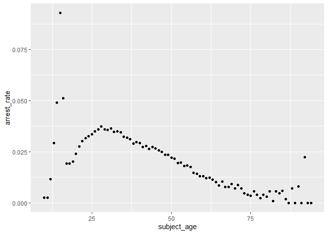
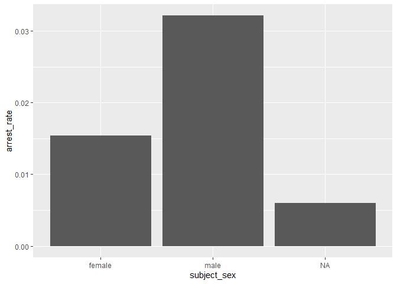
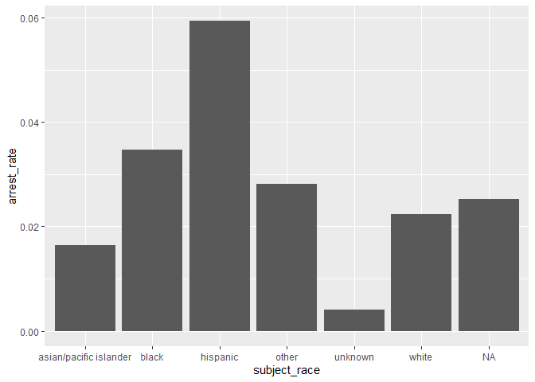

Massachusetts Highway Stops
================
Isa de Luis
2025-04-24

- [Grading Rubric](#grading-rubric)
  - [Individual](#individual)
  - [Submission](#submission)
- [Setup](#setup)
  - [**q1** Go to the Stanford Open Policing Project page and download
    the Massachusetts State Police records in `Rds` format. Move the
    data to your `data` folder and match the `filename` to load the
    data.](#q1-go-to-the-stanford-open-policing-project-page-and-download-the-massachusetts-state-police-records-in-rds-format-move-the-data-to-your-data-folder-and-match-the-filename-to-load-the-data)
- [EDA](#eda)
  - [**q2** Do your “first checks” on the dataset. What are the basic
    facts about this
    dataset?](#q2-do-your-first-checks-on-the-dataset-what-are-the-basic-facts-about-this-dataset)
  - [**q3** Check the set of factor levels for `subject_race` and
    `raw_Race`. What do you note about overlap / difference between the
    two
    sets?](#q3-check-the-set-of-factor-levels-for-subject_race-and-raw_race-what-do-you-note-about-overlap--difference-between-the-two-sets)
  - [**q4** Check whether `subject_race` and `raw_Race` match for a
    large fraction of cases. Which of the two hypotheses above is most
    likely, based on your
    results?](#q4-check-whether-subject_race-and-raw_race-match-for-a-large-fraction-of-cases-which-of-the-two-hypotheses-above-is-most-likely-based-on-your-results)
  - [Vis](#vis)
    - [**q5** Compare the *arrest rate*—the fraction of total cases in
      which the subject was arrested—across different factors. Create as
      many visuals (or tables) as you need, but make sure to check the
      trends across all of the `subject` variables. Answer the questions
      under *observations*
      below.](#q5-compare-the-arrest-ratethe-fraction-of-total-cases-in-which-the-subject-was-arrestedacross-different-factors-create-as-many-visuals-or-tables-as-you-need-but-make-sure-to-check-the-trends-across-all-of-the-subject-variables-answer-the-questions-under-observations-below)
- [Modeling](#modeling)
  - [**q6** Run the following code and interpret the regression
    coefficients. Answer the the questions under *observations*
    below.](#q6-run-the-following-code-and-interpret-the-regression-coefficients-answer-the-the-questions-under-observations-below)
  - [**q7** Re-fit the logistic regression from q6 setting `"white"` as
    the reference level for `subject_race`. Interpret the the model
    terms and answer the questions
    below.](#q7-re-fit-the-logistic-regression-from-q6-setting-white-as-the-reference-level-for-subject_race-interpret-the-the-model-terms-and-answer-the-questions-below)
  - [**q8** Re-fit the model using a factor indicating the presence of
    contraband in the subject’s vehicle. Answer the questions under
    *observations*
    below.](#q8-re-fit-the-model-using-a-factor-indicating-the-presence-of-contraband-in-the-subjects-vehicle-answer-the-questions-under-observations-below)
  - [**q9** Go deeper: Pose at least one more question about the data
    and fit at least one more model in support of answering that
    question.](#q9-go-deeper-pose-at-least-one-more-question-about-the-data-and-fit-at-least-one-more-model-in-support-of-answering-that-question)
  - [Further Reading](#further-reading)

*Purpose*: In this last challenge we’ll focus on using logistic
regression to study a large, complicated dataset. Interpreting the
results of a model can be challenging—both in terms of the statistics
and the real-world reasoning—so we’ll get some practice in this
challenge.

<!-- include-rubric -->

# Grading Rubric

<!-- -------------------------------------------------- -->

Unlike exercises, **challenges will be graded**. The following rubrics
define how you will be graded, both on an individual and team basis.

## Individual

<!-- ------------------------- -->

| Category | Needs Improvement | Satisfactory |
|----|----|----|
| Effort | Some task **q**’s left unattempted | All task **q**’s attempted |
| Observed | Did not document observations, or observations incorrect | Documented correct observations based on analysis |
| Supported | Some observations not clearly supported by analysis | All observations clearly supported by analysis (table, graph, etc.) |
| Assessed | Observations include claims not supported by the data, or reflect a level of certainty not warranted by the data | Observations are appropriately qualified by the quality & relevance of the data and (in)conclusiveness of the support |
| Specified | Uses the phrase “more data are necessary” without clarification | Any statement that “more data are necessary” specifies which *specific* data are needed to answer what *specific* question |
| Code Styled | Violations of the [style guide](https://style.tidyverse.org/) hinder readability | Code sufficiently close to the [style guide](https://style.tidyverse.org/) |

## Submission

<!-- ------------------------- -->

Make sure to commit both the challenge report (`report.md` file) and
supporting files (`report_files/` folder) when you are done! Then submit
a link to Canvas. **Your Challenge submission is not complete without
all files uploaded to GitHub.**

*Background*: We’ll study data from the [Stanford Open Policing
Project](https://openpolicing.stanford.edu/data/), specifically their
dataset on Massachusetts State Patrol police stops.

``` r
library(tidyverse)
```

    ## Warning: package 'tidyverse' was built under R version 4.3.3

    ## Warning: package 'ggplot2' was built under R version 4.3.3

    ## Warning: package 'tidyr' was built under R version 4.3.3

    ## Warning: package 'purrr' was built under R version 4.3.3

    ## Warning: package 'lubridate' was built under R version 4.3.3

    ## ── Attaching core tidyverse packages ──────────────────────── tidyverse 2.0.0 ──
    ## ✔ dplyr     1.1.4     ✔ readr     2.1.5
    ## ✔ forcats   1.0.0     ✔ stringr   1.5.1
    ## ✔ ggplot2   3.5.1     ✔ tibble    3.2.1
    ## ✔ lubridate 1.9.4     ✔ tidyr     1.3.1
    ## ✔ purrr     1.0.4     
    ## ── Conflicts ────────────────────────────────────────── tidyverse_conflicts() ──
    ## ✖ dplyr::filter() masks stats::filter()
    ## ✖ dplyr::lag()    masks stats::lag()
    ## ℹ Use the conflicted package (<http://conflicted.r-lib.org/>) to force all conflicts to become errors

``` r
library(broom)
```

    ## Warning: package 'broom' was built under R version 4.3.3

# Setup

### **q1** Go to the [Stanford Open Policing Project](https://openpolicing.stanford.edu/data/) page and download the Massachusetts State Police records in `Rds` format. Move the data to your `data` folder and match the `filename` to load the data.

*Note*: An `Rds` file is an R-specific file format. The function
`readRDS` will read these files.

``` r
## TODO: Download the data, move to your data folder, and load it
filename <- "data/ma_statewide_2020_04_01.csv"
df_data <- read_csv(filename)
```

    ## Rows: 3416238 Columns: 24
    ## ── Column specification ────────────────────────────────────────────────────────
    ## Delimiter: ","
    ## chr  (11): location, county_name, subject_race, subject_sex, type, outcome, ...
    ## dbl   (2): raw_row_number, subject_age
    ## lgl  (10): arrest_made, citation_issued, warning_issued, contraband_found, c...
    ## date  (1): date
    ## 
    ## ℹ Use `spec()` to retrieve the full column specification for this data.
    ## ℹ Specify the column types or set `show_col_types = FALSE` to quiet this message.

# EDA

<!-- -------------------------------------------------- -->

### **q2** Do your “first checks” on the dataset. What are the basic facts about this dataset?

``` r
glimpse(df_data)
```

    ## Rows: 3,416,238
    ## Columns: 24
    ## $ raw_row_number             <dbl> 1, 2, 3, 4, 5, 6, 7, 8, 9, 10, 11, 64, 65, …
    ## $ date                       <date> 2007-06-06, 2007-06-07, 2007-06-07, 2007-0…
    ## $ location                   <chr> "MIDDLEBOROUGH", "SEEKONK", "MEDFORD", "MED…
    ## $ county_name                <chr> "Plymouth County", "Bristol County", "Middl…
    ## $ subject_age                <dbl> 33, 36, 56, 37, 22, 34, 54, 31, 21, 56, 56,…
    ## $ subject_race               <chr> "white", "white", "white", "white", "hispan…
    ## $ subject_sex                <chr> "male", "male", "female", "male", "female",…
    ## $ type                       <chr> "vehicular", "vehicular", "vehicular", "veh…
    ## $ arrest_made                <lgl> FALSE, FALSE, FALSE, FALSE, FALSE, FALSE, F…
    ## $ citation_issued            <lgl> TRUE, FALSE, FALSE, FALSE, TRUE, TRUE, TRUE…
    ## $ warning_issued             <lgl> FALSE, TRUE, TRUE, TRUE, FALSE, FALSE, FALS…
    ## $ outcome                    <chr> "citation", "warning", "warning", "warning"…
    ## $ contraband_found           <lgl> NA, FALSE, NA, NA, NA, NA, NA, NA, NA, NA, …
    ## $ contraband_drugs           <lgl> NA, FALSE, NA, NA, NA, NA, NA, NA, NA, NA, …
    ## $ contraband_weapons         <lgl> NA, FALSE, NA, NA, NA, NA, NA, NA, NA, NA, …
    ## $ contraband_alcohol         <lgl> FALSE, FALSE, FALSE, FALSE, FALSE, FALSE, F…
    ## $ contraband_other           <lgl> NA, FALSE, NA, NA, NA, NA, NA, NA, NA, NA, …
    ## $ frisk_performed            <lgl> NA, FALSE, NA, NA, NA, NA, NA, NA, NA, NA, …
    ## $ search_conducted           <lgl> FALSE, TRUE, FALSE, FALSE, FALSE, FALSE, FA…
    ## $ search_basis               <chr> NA, "other", NA, NA, NA, NA, NA, NA, NA, NA…
    ## $ reason_for_stop            <chr> "Speed", NA, NA, NA, NA, "Speed", NA, NA, N…
    ## $ vehicle_type               <chr> "Passenger", "Commercial", "Passenger", "Co…
    ## $ vehicle_registration_state <chr> "MA", "MA", "MA", "MA", "MA", "MA", "MA", "…
    ## $ raw_Race                   <chr> "White", "White", "White", "White", "Hispan…

``` r
summary(df_data)
```

    ##  raw_row_number         date              location         county_name       
    ##  Min.   :      1   Min.   :2007-01-01   Length:3416238     Length:3416238    
    ##  1st Qu.: 855935   1st Qu.:2009-04-22   Class :character   Class :character  
    ##  Median :1710138   Median :2011-07-08   Mode  :character   Mode  :character  
    ##  Mean   :1710025   Mean   :2011-07-16                                        
    ##  3rd Qu.:2564234   3rd Qu.:2013-08-27                                        
    ##  Max.   :3418298   Max.   :2015-12-31                                        
    ##                                                                              
    ##   subject_age     subject_race       subject_sex            type          
    ##  Min.   :10.00    Length:3416238     Length:3416238     Length:3416238    
    ##  1st Qu.:25.00    Class :character   Class :character   Class :character  
    ##  Median :34.00    Mode  :character   Mode  :character   Mode  :character  
    ##  Mean   :36.47                                                            
    ##  3rd Qu.:46.00                                                            
    ##  Max.   :94.00                                                            
    ##  NA's   :158006                                                           
    ##  arrest_made     citation_issued warning_issued    outcome         
    ##  Mode :logical   Mode :logical   Mode :logical   Length:3416238    
    ##  FALSE:3323303   FALSE:1244039   FALSE:2269244   Class :character  
    ##  TRUE :92019     TRUE :2171283   TRUE :1146078   Mode  :character  
    ##  NA's :916       NA's :916       NA's :916                         
    ##                                                                    
    ##                                                                    
    ##                                                                    
    ##  contraband_found contraband_drugs contraband_weapons contraband_alcohol
    ##  Mode :logical    Mode :logical    Mode :logical      Mode :logical     
    ##  FALSE:28256      FALSE:36296      FALSE:53237        FALSE:3400070     
    ##  TRUE :27474      TRUE :19434      TRUE :2493         TRUE :16168       
    ##  NA's :3360508    NA's :3360508    NA's :3360508                        
    ##                                                                         
    ##                                                                         
    ##                                                                         
    ##  contraband_other frisk_performed search_conducted search_basis      
    ##  Mode :logical    Mode :logical   Mode :logical    Length:3416238    
    ##  FALSE:51708      FALSE:51029     FALSE:3360508    Class :character  
    ##  TRUE :4022       TRUE :3602      TRUE :55730      Mode  :character  
    ##  NA's :3360508    NA's :3361607                                      
    ##                                                                      
    ##                                                                      
    ##                                                                      
    ##  reason_for_stop    vehicle_type       vehicle_registration_state
    ##  Length:3416238     Length:3416238     Length:3416238            
    ##  Class :character   Class :character   Class :character          
    ##  Mode  :character   Mode  :character   Mode  :character          
    ##                                                                  
    ##                                                                  
    ##                                                                  
    ##                                                                  
    ##    raw_Race        
    ##  Length:3416238    
    ##  Class :character  
    ##  Mode  :character  
    ##                    
    ##                    
    ##                    
    ## 

``` r
head(df_data)
```

    ## # A tibble: 6 × 24
    ##   raw_row_number date       location      county_name   subject_age subject_race
    ##            <dbl> <date>     <chr>         <chr>               <dbl> <chr>       
    ## 1              1 2007-06-06 MIDDLEBOROUGH Plymouth Cou…          33 white       
    ## 2              2 2007-06-07 SEEKONK       Bristol Coun…          36 white       
    ## 3              3 2007-06-07 MEDFORD       Middlesex Co…          56 white       
    ## 4              4 2007-06-07 MEDFORD       Middlesex Co…          37 white       
    ## 5              5 2007-06-07 EVERETT       Middlesex Co…          22 hispanic    
    ## 6              6 2007-06-07 MEDFORD       Middlesex Co…          34 white       
    ## # ℹ 18 more variables: subject_sex <chr>, type <chr>, arrest_made <lgl>,
    ## #   citation_issued <lgl>, warning_issued <lgl>, outcome <chr>,
    ## #   contraband_found <lgl>, contraband_drugs <lgl>, contraband_weapons <lgl>,
    ## #   contraband_alcohol <lgl>, contraband_other <lgl>, frisk_performed <lgl>,
    ## #   search_conducted <lgl>, search_basis <chr>, reason_for_stop <chr>,
    ## #   vehicle_type <chr>, vehicle_registration_state <chr>, raw_Race <chr>

**Observations**:

- What are the basic facts about this dataset?
- The data set contains data about different traffic stops on MA
  Highways
- For each stop, the following data was recorded:
  - Date
  - Location (city)
  - County
  - Age of the driver
  - Race of the driver
  - Sex of the driver
  - Type of traffic stop (there are more than vehicular traffic stops?)
  - If there was an arrest made
  - If a citation was issued
  - If a warnin was issued
  - The outcome
  - If contaband was found, and what type of contraband it was
  - If a frisk was performed
  - If a search was confucted and the basis for it
  - Reason for stop
  - Vehicle type
  - Vehicle state registration
- Questions:
  - What other reasons for stops are there other than speed?
  - Can both a citation and a warning be issued?

Note that we have both a `subject_race` and `race_Raw` column. There are
a few possibilities as to what `race_Raw` represents:

- `race_Raw` could be the race of the police officer in the stop
- `race_Raw` could be an unprocessed version of `subject_race`

Let’s try to distinguish between these two possibilities.

### **q3** Check the set of factor levels for `subject_race` and `raw_Race`. What do you note about overlap / difference between the two sets?

``` r
df_data |>
  count(subject_race) 
```

    ## # A tibble: 7 × 2
    ##   subject_race                 n
    ##   <chr>                    <int>
    ## 1 asian/pacific islander  166842
    ## 2 black                   351610
    ## 3 hispanic                338317
    ## 4 other                    11008
    ## 5 unknown                  17017
    ## 6 white                  2529780
    ## 7 <NA>                      1664

``` r
df_data |>
  count(raw_Race)
```

    ## # A tibble: 9 × 2
    ##   raw_Race                                            n
    ##   <chr>                                           <int>
    ## 1 A                                                   2
    ## 2 American Indian or Alaskan Native               11006
    ## 3 Asian or Pacific Islander                      102292
    ## 4 Black                                          351610
    ## 5 Hispanic                                       338317
    ## 6 Middle Eastern or East Indian (South Asian)     64550
    ## 7 None - for no operator present citations only   17017
    ## 8 White                                         2529780
    ## 9 <NA>                                             1664

``` r
# find overlap / differences between two sets

subject_lvls <-
  df_data |>
  pull(subject_race) |>
  unique()

raw_lvls <-
  df_data |>
  pull(raw_Race) |>
  unique()

# What’s in both?
intersect(subject_lvls, raw_lvls)
```

    ## [1] NA

``` r
# What’s only in subject_race?
setdiff(subject_lvls, raw_lvls)
```

    ## [1] "white"                  "hispanic"               "black"                 
    ## [4] "asian/pacific islander" "other"                  "unknown"

``` r
# What’s only in raw_Race?
setdiff(raw_lvls, subject_lvls)
```

    ## [1] "White"                                        
    ## [2] "Hispanic"                                     
    ## [3] "Black"                                        
    ## [4] "Asian or Pacific Islander"                    
    ## [5] "Middle Eastern or East Indian (South Asian)"  
    ## [6] "American Indian or Alaskan Native"            
    ## [7] "None - for no operator present citations only"
    ## [8] "A"

``` r
# doing this for my own learning/curiosity about data cleaning

# I want to change the values in raw_Race to match what we have in subject_race
# Asian or Pacific Islander -> asian/pacific islander
# Black -> black
# Hispanic -> hispanic
# White -> white

df_data_cleaned <- df_data |>
  mutate(
    raw_Race = case_when(
      raw_Race == "Asian or Pacific Islander" ~ "asian/pacific islander",
      raw_Race == "Black"                    ~ "black",
      raw_Race == "Hispanic"                 ~ "hispanic",
      raw_Race == "White"                    ~ "white",
      TRUE                                   ~ raw_Race     # everything else stays the same
    )
  )


# find overlap / differences between two sets

subject_lvls <-
  df_data_cleaned |>
  pull(subject_race) |>
  unique()

raw_lvls <-
  df_data_cleaned |>
  pull(raw_Race) |>
  unique()

# What’s in both?
intersect(subject_lvls, raw_lvls)
```

    ## [1] "white"                  "hispanic"               "black"                 
    ## [4] "asian/pacific islander" NA

``` r
# What’s only in subject_race?
setdiff(subject_lvls, raw_lvls)
```

    ## [1] "other"   "unknown"

``` r
# What’s only in raw_Race?
setdiff(raw_lvls, subject_lvls)
```

    ## [1] "Middle Eastern or East Indian (South Asian)"  
    ## [2] "American Indian or Alaskan Native"            
    ## [3] "None - for no operator present citations only"
    ## [4] "A"

**Observations**:

- What are the unique values for `subject_race`?
  - asian/pacific islander
  - black
  - hispanic
  - other
  - unknown
  - white
  - NA
- What are the unique values for `raw_Race`?
  - A
  - Asian or Pacific Islander
  - Black
  - Hispanic
  - Middle Eastern or East Indian (South Asian)
  - None - for no operator present citations only
  - White
  - NA
- What is the overlap between the two sets?
  - While there is no overlap between column names due to
    capitalization, there are very similar categories:
    - Asian/pacific islanders
    - black
    - white
    - Hispanic
    - NA
- What is the difference between the two sets?
  - In the `raw_Race` set there are a few additional categories – there
    is an `A` category, which could possibly be a transcription mistake,
    a `Middle Eastern or East Indian` category, an
    `American Indan or Alaskan Native` category, and a `None` category.
    In the `subject_race` set, there is an `unknown` category, which
    isn’t present in the `raw_Race` set

### **q4** Check whether `subject_race` and `raw_Race` match for a large fraction of cases. Which of the two hypotheses above is most likely, based on your results?

*Note*: Just to be clear, I’m *not* asking you to do a *statistical*
hypothesis test.

``` r
## TODO: Devise your own way to test the hypothesis posed above.
df_q4 <- 
  df_data_cleaned |>
  mutate(
    race_match = subject_race == raw_Race
  )

df_q4 |>
  summarise(
    total       = n(),
    n_matched   = sum(race_match, na.rm = TRUE),
    n_unmatched = sum(!race_match, na.rm = TRUE),
    pct_matched = mean(race_match, na.rm = TRUE) * 100
  )
```

    ## # A tibble: 1 × 4
    ##     total n_matched n_unmatched pct_matched
    ##     <int>     <int>       <int>       <dbl>
    ## 1 3416238   3321999       92575        97.3

**Observations**

Between the two hypotheses:

- `race_Raw` could be the race of the police officer in the stop
- `race_Raw` could be an unprocessed version of `subject_race`

which is most plausible, based on your results?

- `race_Raw` seems to be an unprocessed version of `subject_race`.

## Vis

<!-- ------------------------- -->

### **q5** Compare the *arrest rate*—the fraction of total cases in which the subject was arrested—across different factors. Create as many visuals (or tables) as you need, but make sure to check the trends across all of the `subject` variables. Answer the questions under *observations* below.

``` r
# subject age
df_data_cleaned |>
  group_by(subject_age) |>
  summarise(
      total_cases = n(),
      total_arrests = sum(arrest_made, na.rm = TRUE),
      arrest_rate = mean(arrest_made, na.rm = TRUE)
    ) |>
  ggplot(aes(x = subject_age, y = arrest_rate)) +
  geom_point()
```

    ## Warning: Removed 1 row containing missing values or values outside the scale range
    ## (`geom_point()`).

<!-- -->

``` r
df_data_cleaned |>
  group_by(subject_sex) |>
  summarise(
      total_cases = n(),
      total_arrests = sum(arrest_made, na.rm = TRUE),
      arrest_rate = mean(arrest_made, na.rm = TRUE)
    ) |>
  ggplot(aes(x = subject_sex, y = arrest_rate)) +
  geom_col()
```

<!-- -->

``` r
df_data_cleaned |>
  group_by(subject_race) |>
  summarise(
      total_cases = n(),
      total_arrests = sum(arrest_made, na.rm = TRUE),
      arrest_rate = mean(arrest_made, na.rm = TRUE)
    ) |>
  ggplot(aes(x = subject_race, y = arrest_rate)) +
  geom_col()
```

<!-- -->

**Observations**: - General observation : The `arrest_rate` tends to be
very low, regardless of factor

- How does `arrest_rate` tend to vary with `subject_age`?
  - Seems to peak in the low/mid twenties. Before ~23 there seems to be
    no trend – perhaps due to a lack of data? After ~23, there’s a clear
    trend – the arrest rate peaks between 25 and 30 before declining.
- How does `arrest_rate` tend to vary with `subject_sex`?
  - Men seem to be arrested more frequently than women
- How does `arrest_rate` tend to vary with `subject_race`?
  - Black, hispanic, and “other” drivers tend to be arrested the most,
    with hispanic drivers having the highest `arrest_rate`. Unknown
    seems to have the lowest arrest rate – I wonder if that’s because
    they were given a traffic citation through virtual means and not by
    having an officer actually stop them.

# Modeling

<!-- -------------------------------------------------- -->

We’re going to use a model to study the relationship between `subject`
factors and arrest rate, but first we need to understand a bit more
about *dummy variables*

### **q6** Run the following code and interpret the regression coefficients. Answer the the questions under *observations* below.

``` r
## NOTE: No need to edit; inspect the estimated model terms.
fit_q6 <-
  glm(
    formula = arrest_made ~ subject_age + subject_race + subject_sex,
    data = df_data %>%
      filter(
        !is.na(arrest_made),
        subject_race %in% c("white", "black", "hispanic")
      ),
    family = "binomial"
  )

fit_q6 %>% tidy()
```

    ## # A tibble: 5 × 5
    ##   term                 estimate std.error statistic   p.value
    ##   <chr>                   <dbl>     <dbl>     <dbl>     <dbl>
    ## 1 (Intercept)           -3.42    0.0150      -228.  0        
    ## 2 subject_age           -0.0142  0.000280     -50.5 0        
    ## 3 subject_racehispanic   0.513   0.0119        43.3 0        
    ## 4 subject_racewhite     -0.380   0.0103       -37.0 3.12e-299
    ## 5 subject_sexmale        0.755   0.00910       83.0 0

**Observations**:

- Which `subject_race` levels are included in fitting the model?
  - white, black, hispanic
- Which `subject_race` levels have terms in the model?
  - white, hispanic

You should find that each factor in the model has a level *missing* in
its set of terms. This is because R represents factors against a
*reference level*: The model treats one factor level as “default”, and
each factor model term represents a change from that “default” behavior.
For instance, the model above treats `subject_sex==male` as the
reference level, so the `subject_sexfemale` term represents the *change
in probability* of arrest due to a person being female (rather than
male).

The this reference level approach to coding factors is necessary for
[technical
reasons](https://www.andrew.cmu.edu/user/achoulde/94842/lectures/lecture10/lecture10-94842.html#why-is-one-of-the-levels-missing-in-the-regression),
but it complicates interpreting the model results. For instance; if we
want to compare two levels, neither of which are the reference level, we
have to consider the difference in their model coefficients. But if we
want to compare all levels against one “baseline” level, then we can
relevel the data to facilitate this comparison.

By default `glm` uses the first factor level present as the reference
level. Therefore we can use
`mutate(factor = fct_relevel(factor, "desired_level"))` to set our
`"desired_level"` as the reference factor.

### **q7** Re-fit the logistic regression from q6 setting `"white"` as the reference level for `subject_race`. Interpret the the model terms and answer the questions below.

``` r
## TODO: Re-fit the logistic regression, but set "white" as the reference
## level for subject_race

fit_q7 <- 
  glm(
    formula = arrest_made ~ subject_age + subject_race + subject_sex,
    data = df_data |>
      filter(
        !is.na(arrest_made),
        subject_race %in% c("white", "black", "hispanic")
      ) |>
      mutate(
        subject_race = fct_relevel(subject_race, "white")
      ),
    family = "binomial"
  )

fit_q7 %>% tidy()
```

    ## # A tibble: 5 × 5
    ##   term                 estimate std.error statistic   p.value
    ##   <chr>                   <dbl>     <dbl>     <dbl>     <dbl>
    ## 1 (Intercept)           -3.80    0.0128      -298.  0        
    ## 2 subject_age           -0.0142  0.000280     -50.5 0        
    ## 3 subject_raceblack      0.380   0.0103        37.0 3.12e-299
    ## 4 subject_racehispanic   0.893   0.00859      104.  0        
    ## 5 subject_sexmale        0.755   0.00910       83.0 0

**Observations**:

- Which `subject_race` level has the highest probability of being
  arrested, according to this model? Which has the lowest probability?
  - According to the model, hispanic people have the highest probability
    of being arrested and white people have the lowest probability of
    being arrested
- What could explain this difference in probabilities of arrest across
  race? List **multiple** possibilities.
  - Racism and implicit biases could lead to police officers arrested
    more hispanic folks
  - There could be some socioeconomic factors at play – if hispanic
    folks live in higher-crime areas and are getting stopped there, it
    may lead to a higher arrest rate.
- Look at the set of variables in the dataset; do any of the columns
  relate to a potential explanation you listed?
  - Maybe contraband_found can show whether particular groups are more
    likely to be searched and have contraband found

One way we can explain differential arrest rates is to include some
measure indicating the presence of an arrestable offense. We’ll do this
in a particular way in the next task.

### **q8** Re-fit the model using a factor indicating the presence of contraband in the subject’s vehicle. Answer the questions under *observations* below.

``` r
## TODO: Repeat the modeling above, but control for whether contraband was found
## during the police stop
fit_q8 <-
  glm(
    formula = arrest_made ~ subject_age + subject_race + subject_sex + contraband_found,
    data = df_data |>
      filter(
        !is.na(arrest_made),
        subject_race %in% c("white", "black", "hispanic")
      ) |>
      mutate(
        subject_race = fct_relevel(subject_race, "white"),
        contraband_found = fct_relevel(as.factor(contraband_found), "FALSE")
      ),
    family = "binomial"
  )
fit_q8 %>% tidy()
```

    ## # A tibble: 6 × 5
    ##   term                 estimate std.error statistic   p.value
    ##   <chr>                   <dbl>     <dbl>     <dbl>     <dbl>
    ## 1 (Intercept)           -2.03    0.0392      -51.8  0        
    ## 2 subject_age            0.0225  0.000866     26.0  2.19e-149
    ## 3 subject_raceblack     -0.0511  0.0270       -1.90 5.80e-  2
    ## 4 subject_racehispanic   0.221   0.0237        9.31 1.32e- 20
    ## 5 subject_sexmale        0.306   0.0257       11.9  1.06e- 32
    ## 6 contraband_foundTRUE   0.609   0.0192       31.7  4.29e-221

**Observations**:

- How does controlling for found contraband affect the `subject_race`
  terms in the model?
  - The coefficient for Black subjects dropped sharply and is now small
    and negative. The coefficient for hispanic subjects also decreased.
- What does the *finding of contraband* tell us about the stop? What
  does it *not* tell us about the stop?
  - Contraband discovery is highly predictive of an arrest -\> suggests
    that the stop revealed evidence of illegal behavior
  - Does NOT tell us whether the initial stop was fair or unbiased
  - Does NOT tell us why the officer chose to search the car

### **q9** Go deeper: Pose at least one more question about the data and fit at least one more model in support of answering that question.

Question: How does the type of contraband found affect arrest rates?

Types of contraband: - Alcohol - Drugs - Weapons - Other
**Observations**:

``` r
## TODO: Repeat the modeling above, but control for whether contraband was found
## during the police stop
fit_q9 <-
  glm(
    formula = arrest_made ~ subject_age + subject_race + subject_sex + contraband_alcohol + contraband_drugs + contraband_weapons + contraband_other,
    data = df_data |>
      filter(
        !is.na(arrest_made),
        subject_race %in% c("white", "black", "hispanic")
      ) |>
      mutate(
        subject_race = fct_relevel(subject_race, "white"),
        contraband_found = fct_relevel(as.factor(contraband_found), "FALSE")
      ),
    family = "binomial"
  )
fit_q9 %>% tidy()
```

    ## # A tibble: 9 × 5
    ##   term                   estimate std.error statistic   p.value
    ##   <chr>                     <dbl>     <dbl>     <dbl>     <dbl>
    ## 1 (Intercept)             -2.01    0.0391      -51.4  0        
    ## 2 subject_age              0.0223  0.000873     25.6  2.68e-144
    ## 3 subject_raceblack       -0.0478  0.0271       -1.77 7.75e-  2
    ## 4 subject_racehispanic     0.212   0.0238        8.90 5.40e- 19
    ## 5 subject_sexmale          0.304   0.0258       11.8  5.13e- 32
    ## 6 contraband_alcoholTRUE   0.633   0.0270       23.5  1.23e-121
    ## 7 contraband_drugsTRUE     0.444   0.0200       22.1  1.27e-108
    ## 8 contraband_weaponsTRUE   0.232   0.0439        5.28 1.32e-  7
    ## 9 contraband_otherTRUE     0.602   0.0345       17.4  4.94e- 68

**Observations** - All types of contraband are strongly associated with
a higher probability of arrest - Finding alcohol or “other” contraband
leads to the largest increases in arrest probability - What is “other”
contraband?? - Finding weapons surprisingly has a smaller coefficient
compared to alcohol and drugs (still positive but less strong than you
might expect) - Racial disparities shrink further when you control not
just for contraband presence, but for what kind of contraband was
found - Differences between White and Black subjects in arrest
probability almost disappear after full adjustment - Hispanic subjects
still have higher odds of arrest even after adjusting for contraband
type

## Further Reading

<!-- -------------------------------------------------- -->

- Stanford Open Policing Project
  [findings](https://openpolicing.stanford.edu/findings/).
