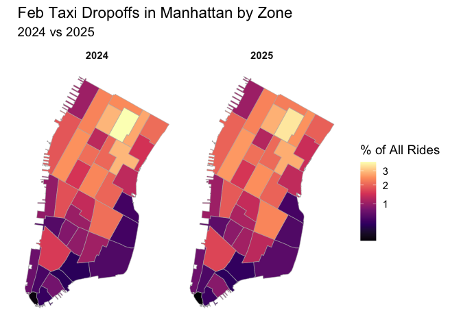
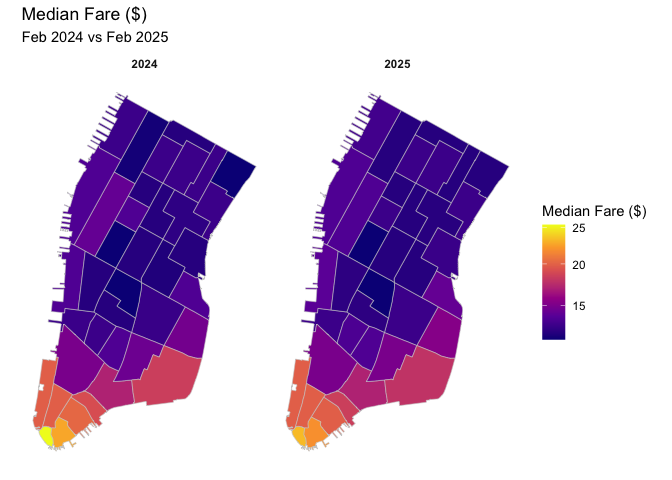
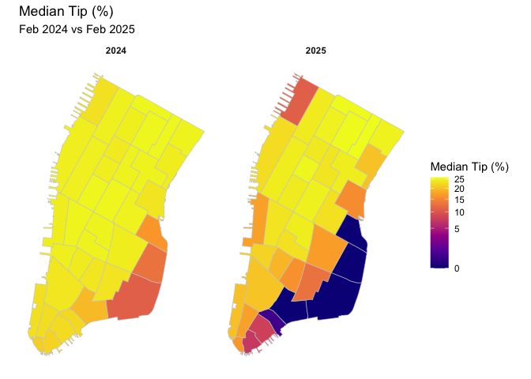
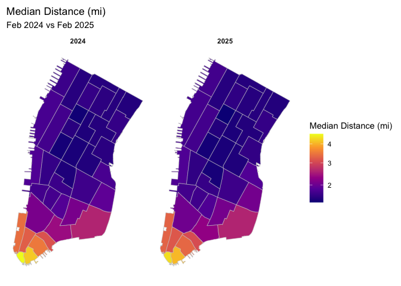
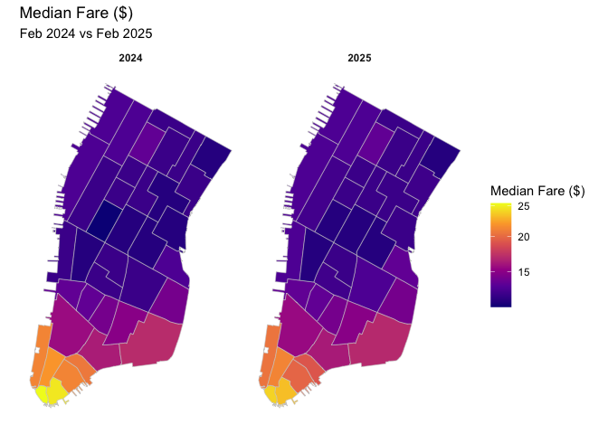
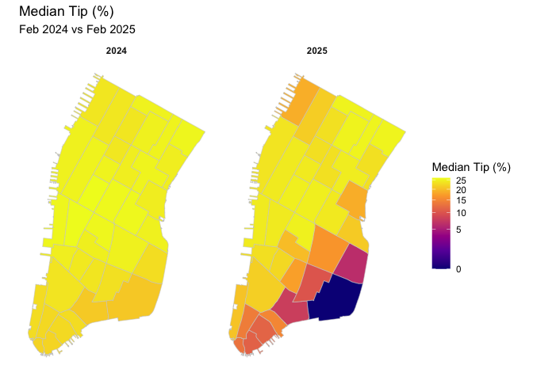
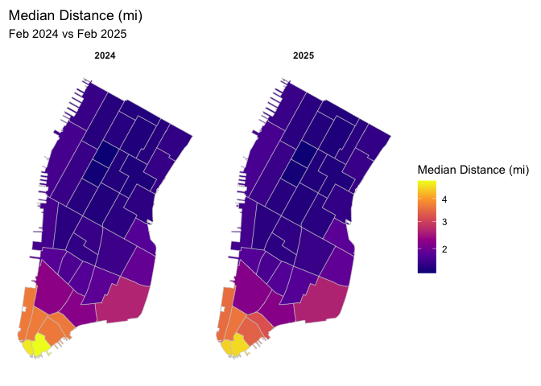

Challenge 13: NYC Taxi Data
================
Isa de Luis & Sam Mendelson
2025-04-28

- [Overview](#overview)
  - [Columns](#columns)
  - [Congestion Pricing vs. Congestion
    Surcharge](#congestion-pricing-vs-congestion-surcharge)
  - [TLC Taxi Zones](#tlc-taxi-zones)
  - [Yellow and Green Cabs](#yellow-and-green-cabs)
- [Hypothesis](#hypothesis)
- [EDA](#eda)
- [Plots](#plots)
  - [Dropoffs By Zone](#dropoffs-by-zone)
  - [Mean Fares, Tips, and Distances by **Pickup
    Location**](#mean-fares-tips-and-distances-by-pickup-location)
  - [Mean Fares, Tips, and Distances by **Dropoff
    Location**](#mean-fares-tips-and-distances-by-dropoff-location)
- [Conclusion](#conclusion)

``` r
if (!require(arrow)) install.packages("arrow")
```

    ## Loading required package: arrow

    ## 
    ## Attaching package: 'arrow'

    ## The following object is masked from 'package:utils':
    ## 
    ##     timestamp

``` r
library(tidyverse)
```

    ## ── Attaching core tidyverse packages ──────────────────────── tidyverse 2.0.0 ──
    ## ✔ dplyr     1.1.4     ✔ readr     2.1.5
    ## ✔ forcats   1.0.0     ✔ stringr   1.5.1
    ## ✔ ggplot2   3.5.1     ✔ tibble    3.2.1
    ## ✔ lubridate 1.9.4     ✔ tidyr     1.3.1
    ## ✔ purrr     1.0.2

    ## ── Conflicts ────────────────────────────────────────── tidyverse_conflicts() ──
    ## ✖ lubridate::duration() masks arrow::duration()
    ## ✖ dplyr::filter()       masks stats::filter()
    ## ✖ dplyr::lag()          masks stats::lag()
    ## ℹ Use the conflicted package (<http://conflicted.r-lib.org/>) to force all conflicts to become errors

``` r
library(arrow)
library(ggplot2)
library(tidyr)
library(dplyr)
library(sf)
```

    ## Linking to GEOS 3.13.0, GDAL 3.8.5, PROJ 9.5.1; sf_use_s2() is TRUE

# Overview

This dataset, [from the NYC Taxi and Limousine
Commission](https://www.nyc.gov/site/tlc/about/tlc-trip-record-data.page),
contains information about taxi trips in New York City.

New York City enacted a **congestion pricing** scheme in January 2025,
which charges a fee for all vehicles entering Manhattan below 60th
Street. While personal vehicles can get charged up to \$9/day (charged
at first entry during a specified calendar day), congestion pricing for
taxis works differently: they pay \$0.75/entry, which is then passed on
to the passenger.

## Columns

| Field Name | Category | Description |
|----|----|----|
| `VendorID` | Vendor Info | A code indicating the TPEP provider that provided the record. 1 = Creative Mobile Technologies, LLC 2 = Curb Mobility, LLC 6 = Myle Technologies Inc 7 = Helix |
| `tpep_pickup_datetime` | Time | The date and time when the meter was engaged. |
| `tpep_dropoff_datetime` | Time | The date and time when the meter was disengaged. |
| `passenger_count` | Passenger Info | The number of passengers in the vehicle. |
| `trip_distance` | Trip Info | The elapsed trip distance in miles reported by the taximeter. |
| `RatecodeID` | Fare Info | The final rate code in effect at the end of the trip. 1 = Standard rate 2 = JFK 3 = Newark 4 = Nassau or Westchester 5 = Negotiated fare 6 = Group ride 99 = Null/unknown |
| `store_and_fwd_flag` | Trip Info | Flag indicating whether the trip record was stored before being sent to the vendor.<br>Y = store and forward trip<br>N = not a store and forward trip |
| `PULocationID` | Location | TLC Taxi Zone where the taximeter was engaged. |
| `DOLocationID` | Location | TLC Taxi Zone where the taximeter was disengaged. |
| `payment_type` | Payment Info | Numeric code indicating how the passenger paid. 0 = Flex Fare 1 = Credit card 2 = Cash 3 = No charge 4 = Dispute 5 = Unknown 6 = Voided trip |
| `fare_amount` | Fare Info | Time-and-distance fare calculated by the meter. [More info](https://www.nyc.gov/site/tlc/passengers/taxi-fare.page) |
| `extra` | Fare Info | Miscellaneous extras and surcharges. |
| `mta_tax` | Tax Info | Tax automatically triggered based on the metered rate. |
| `tip_amount` | Fare Info | Tip amount – automatically populated for credit card trips. Cash tips are not included. |
| `tolls_amount` | Fare Info | Total amount of all tolls paid in trip. |
| `improvement_surcharge` | Fare Info | Improvement surcharge assessed at the flag drop since 2015. |
| `total_amount` | Fare Info | Total amount charged to passengers (excludes cash tips). |
| `congestion_surcharge` | Fare Info | Total amount collected for NYS congestion surcharge. |
| `airport_fee` | Fare Info | For pickups at LaGuardia and JFK airports only. |
| `cbd_congestion_fee` | Fare Info | Per-trip charge for MTA’s Congestion Relief Zone (starting Jan. 5, 2025). |

## Congestion Pricing vs. Congestion Surcharge

You may have noticed that there are two different fees related to
congestion in the dataset: `congestion_surcharge` and
`cbd_congestion_fee`. The former is a fee that was introduced in 2019 to
help fund the MTA, while the latter is a new fee that was introduced in
2025 as part of the congestion pricing scheme.

The politics of congestion pricing have been contentious in New York
City for years. The plan was first proposed in 2007, but it wasn’t until
2019 that the state legislature passed a bill allowing for congestion
pricing. Tolls for private vehicles were sacked, however a \$2.50 per
ride fee for taxi and ride share trips that originate in, end in, or
pass through Manhattan below 96th street was established, which is in
our dataset as the `congestion_surcharge`.

In 2025, the congestion pricing scheme was fully implemented, which is
in our dataset as `cbd_congestion_fee`. This fee is charged to all
vehicles entering Manhattan below 60th Street, regardless of whether
they are taxis or private vehicles. The goal of the fee is to reduce
traffic congestion and improve air quality in Manhattan.

For taxi trips, these two fees can add together. For example, a trip
going from 112th Street to 16th Street would pay both fees, as the trip:

- Begins above 96th street - no fee
- Ends below 96th street, therefore the `congestion_surcharge` is
  applied
- Needs to enter the congestion pricing zone (destination is below 60th
  street), therefore the `cbd_congestion_fee` is applied

This results in a total fee of \$3.25 (\$2.50 from the congestion
surcharge and \$0.75 from the congestion pricing scheme) applied to the
trip.

Read more about the congestion *surcharge* (2019)
[here](https://www.tax.ny.gov/bus/cs/csidx.htm) and the congestion
*pricing* (2025)
[here](https://portal.311.nyc.gov/article/?kanumber=KA-03612).

## TLC Taxi Zones

The dataset tells us, roughly, where the trips start and end. New York
City is broken up into TLC taxi zones, and we have the pickup and
dropoff zone IDs in the dataset. The TLC taxi zones are not the same as
the NYC neighborhoods, but they are similar. For example, the Upper West
Side is broken up into several different TLC taxi zones, while the East
Village is only one zone.

The Metropolitan Transportation Authority (MTA, New York City’s public
transportation authority) released a complimentary dataset that lists
the zones included in the congestion pricing scheme and their
corresponding geographic boundaries. This dataset is available
[here](https://data.ny.gov/Transportation/MTA-Central-Business-District-Taxi-Zones/yfdc-w5jh/about_data).

The TLC also released a CSV containing each Zone’s ID and the
name/neighborhood name (it also includes whether green cabs can pick up
there, but we’re not using that data). We use this data to provide
neighborhood names, which are more understandable than just the zone
numbers. This data is available from the same site as the original
dataset.

## Yellow and Green Cabs

When asked about the color of a New York City taxicab, the first color
that likely comes to mind for many is yellow. When we see taxis in
movies, TV, and, even just around NYC, they’re almost always yellow.

However, NYC has two colors of cabs, with just one difference: yellow
cabs can pick up passengers anywhere in NYC including airports, however
green cabs (also knows as boro cabs, whose color is called “apple
green”) can not **pick up** passengers:

- At NYC airports, including JFK Airport and LaGuardia Airport

- In Manhattan, south of East 97th Street

- In Manhattan, south of West 110th Street

Green cabs can, however, **drop off** passengers anywhere in NYC. For
example, they could drive someone from Brooklyn to the Upper East Side,
however not the other way around. Therefore, we decided to include green
cab data in our dataset.

# Hypothesis

We hypothesize that, as a result of the congestion *pricing*, the number
of trips that **terminate in the congestion *pricing* zones will
decrease**.

If someone was, for example, going to take a taxi to Carnegie Hall (on
57th Street), the taxi driver might (smartly) recommend that they get
out on 60th and just walk to Carnegie Hall to save the fee. In their
self interest, they would want to get another trip sooner, and
passengers may tip more knowing that the driver saved them money - if
they tipped an extra \$0.75, then the entire fee would go to the driver.

# EDA

Here, we load the data (provided by the TLC (Taxi and Limousine
Commission of New York State) as Apache Parquet files) into R.

Green

``` r
df_feb_25_green <- read_parquet("data/project/green_tripdata_2025-02.parquet")
df_feb_25_yellow <- read_parquet("data/project/yellow_tripdata_2025-02.parquet")

df_feb_24_green <- read_parquet("data/project/green_tripdata_2024-02.parquet")
df_feb_24_yellow <- read_parquet("data/project/yellow_tripdata_2024-02.parquet")
```

Since each month and each taxi color is a separate file, we need to
combine them. See [Yellow and Green Cabs](#yellow-and-green-cabs) for
more information on the difference between green and yellow cabs.

``` r
df_feb_25_green <- 
  df_feb_25_green |>
  mutate(year = 2025,
         color = "green")

df_feb_24_green <- 
  df_feb_24_green |>
  mutate(year = 2024,
         color = "green")

df_feb_25_yellow <- 
  df_feb_25_yellow |>
  mutate(year = 2025,
         color = "yellow")

df_feb_24_yellow <- 
  df_feb_24_yellow |>
  mutate(year = 2024,
         color = "yellow")
df_combined <- bind_rows(df_feb_25_green, df_feb_25_yellow, df_feb_24_green, df_feb_24_yellow)
```

Let’s take a quick look at the data we combined. We added two columns,
`year` and `color` to differentiate the datasets. No `month` column is
needed: both datasets are from February.

``` r
glimpse(df_combined)
```

    ## Rows: 6,685,267
    ## Columns: 26
    ## $ VendorID              <int> 2, 2, 2, 1, 2, 2, 2, 2, 2, 2, 2, 2, 2, 2, 2, 2, …
    ## $ lpep_pickup_datetime  <dttm> 2025-01-31 19:12:15, 2025-01-31 18:57:05, 2025-…
    ## $ lpep_dropoff_datetime <dttm> 2025-01-31 19:15:48, 2025-01-31 19:24:24, 2025-…
    ## $ store_and_fwd_flag    <chr> "N", "N", "N", "N", "N", "N", "N", "N", "N", "N"…
    ## $ RatecodeID            <int> 1, 1, 1, 1, 1, 1, 1, 1, 5, 1, 1, 1, 1, 1, 1, 1, …
    ## $ PULocationID          <int> 166, 255, 75, 97, 7, 7, 130, 75, 264, 97, 74, 16…
    ## $ DOLocationID          <int> 41, 161, 182, 209, 223, 223, 130, 211, 264, 80, …
    ## $ passenger_count       <int> 1, 1, 2, 1, 1, 1, 1, 1, 0, 1, 1, 1, 1, 1, 1, 1, …
    ## $ trip_distance         <dbl> 0.65, 6.57, 8.36, 2.40, 1.31, 2.19, 0.81, 5.45, …
    ## $ fare_amount           <dbl> 6.5, 31.7, 36.6, 12.8, 10.7, 11.4, 7.2, 26.1, 14…
    ## $ extra                 <dbl> 1.0, 1.0, 1.0, 4.5, 1.0, 1.0, 1.0, 1.0, 0.0, 1.0…
    ## $ mta_tax               <dbl> 0.5, 0.5, 0.5, 1.5, 0.5, 0.5, 0.5, 0.5, 0.0, 0.5…
    ## $ tip_amount            <dbl> 1.80, 0.00, 0.00, 3.75, 2.64, 4.17, 0.00, 6.42, …
    ## $ tolls_amount          <dbl> 0, 0, 0, 0, 0, 0, 0, 0, 0, 0, 0, 0, 0, 0, 0, 0, …
    ## $ ehail_fee             <dbl> NA, NA, NA, NA, NA, NA, NA, NA, NA, NA, NA, NA, …
    ## $ improvement_surcharge <dbl> 1, 1, 1, 1, 1, 1, 1, 1, 1, 1, 1, 1, 1, 1, 1, 1, …
    ## $ total_amount          <dbl> 10.80, 37.70, 39.10, 22.55, 15.84, 18.07, 9.70, …
    ## $ payment_type          <int> 1, 2, 2, 1, 1, 1, 2, 1, 1, 1, 2, 2, 2, 1, 2, 1, …
    ## $ trip_type             <int> 1, 1, 1, 1, 1, 1, 1, 1, 2, 1, 1, 1, 1, 1, 1, 1, …
    ## $ congestion_surcharge  <dbl> 0.00, 2.75, 0.00, 2.75, 0.00, 0.00, 0.00, 2.75, …
    ## $ cbd_congestion_fee    <dbl> 0.00, 0.75, 0.00, 0.75, 0.00, 0.00, 0.00, 0.75, …
    ## $ year                  <dbl> 2025, 2025, 2025, 2025, 2025, 2025, 2025, 2025, …
    ## $ color                 <chr> "green", "green", "green", "green", "green", "gr…
    ## $ tpep_pickup_datetime  <dttm> NA, NA, NA, NA, NA, NA, NA, NA, NA, NA, NA, NA,…
    ## $ tpep_dropoff_datetime <dttm> NA, NA, NA, NA, NA, NA, NA, NA, NA, NA, NA, NA,…
    ## $ Airport_fee           <dbl> NA, NA, NA, NA, NA, NA, NA, NA, NA, NA, NA, NA, …

``` r
head(df_combined)
```

    ## # A tibble: 6 × 26
    ##   VendorID lpep_pickup_datetime lpep_dropoff_datetime store_and_fwd_flag
    ##      <int> <dttm>               <dttm>                <chr>             
    ## 1        2 2025-01-31 19:12:15  2025-01-31 19:15:48   N                 
    ## 2        2 2025-01-31 18:57:05  2025-01-31 19:24:24   N                 
    ## 3        2 2025-01-31 19:24:26  2025-01-31 19:49:54   N                 
    ## 4        1 2025-01-31 19:17:15  2025-01-31 19:25:56   N                 
    ## 5        2 2025-01-31 19:17:36  2025-01-31 19:26:36   N                 
    ## 6        2 2025-01-31 19:40:18  2025-01-31 19:48:55   N                 
    ## # ℹ 22 more variables: RatecodeID <int>, PULocationID <int>,
    ## #   DOLocationID <int>, passenger_count <int>, trip_distance <dbl>,
    ## #   fare_amount <dbl>, extra <dbl>, mta_tax <dbl>, tip_amount <dbl>,
    ## #   tolls_amount <dbl>, ehail_fee <dbl>, improvement_surcharge <dbl>,
    ## #   total_amount <dbl>, payment_type <int>, trip_type <int>,
    ## #   congestion_surcharge <dbl>, cbd_congestion_fee <dbl>, year <dbl>,
    ## #   color <chr>, tpep_pickup_datetime <dttm>, tpep_dropoff_datetime <dttm>, …

# Plots

## Dropoffs By Zone

``` r
zone_lookup <- read_csv("data/project/taxi_zones.csv")
```

    ## Rows: 38 Columns: 2
    ## ── Column specification ────────────────────────────────────────────────────────
    ## Delimiter: ","
    ## chr (1): Polygon
    ## dbl (1): Taxi Zone
    ## 
    ## ℹ Use `spec()` to retrieve the full column specification for this data.
    ## ℹ Specify the column types or set `show_col_types = FALSE` to quiet this message.

``` r
zone_lookup <- zone_lookup |>
  rename(LocationID = `Taxi Zone`)

zone_names <- read_csv("data/project/taxi_zone_lookup.csv")
```

    ## Rows: 265 Columns: 4
    ## ── Column specification ────────────────────────────────────────────────────────
    ## Delimiter: ","
    ## chr (3): Borough, Zone, service_zone
    ## dbl (1): LocationID
    ## 
    ## ℹ Use `spec()` to retrieve the full column specification for this data.
    ## ℹ Specify the column types or set `show_col_types = FALSE` to quiet this message.

``` r
zones_sf <- zone_lookup |>     
  st_as_sf(wkt = "Polygon", crs = 4326)        

df_zone_by_year <- df_combined |>
  group_by(year, DOLocationID) |>
  summarise(n_rides = n(), .groups = "drop")

df_zone_by_year <- df_zone_by_year |>
  group_by(year) |>
  mutate(
    frac  = n_rides / sum(n_rides),       
    pct   = frac * 100                    
  ) %>%
  ungroup() |>
  left_join(zone_names,
            by = c("DOLocationID" = "LocationID"))

map_data <- zones_sf |>
  left_join(df_zone_by_year,
            by = c("LocationID" = "DOLocationID"))

map_data |>
  ggplot() +
  geom_sf(aes(fill = pct), color = "grey70", size = 0.1) +
  scale_fill_viridis_c(
    option    = "magma",
    trans     = "sqrt",
    na.value  = "white"
  ) +
  facet_wrap(~ year) +
  labs(
    title    = "Feb Taxi Dropoffs in Manhattan by Zone",
    subtitle = "2024 vs 2025",
    fill     = "% of All Rides"
  ) +
  theme_minimal(base_size = 14) +
  theme(
    axis.text    = element_blank(),
    axis.ticks   = element_blank(),
    panel.grid   = element_blank(),
    strip.text   = element_text(face = "bold")
  ) 
```

<!-- -->

Here, we’re looking at all the zones affected by congestion pricing,
comparing February 2024 to February 2025. Congestion pricing has been
enabled for the entirety of February 2025. The color indicates the
percent of total trips that ended in each zone, with darker representing
less and lighter representing more trips. The maps look very similar,
with the most trips terminating in Zone 161 (Midtown Center).

Our central claim is that traffic to these zones would decrease after
the congestion zone pricing. At a quick glance, this *might* be
accurate, but let’s verify further. The zones at the top of the
congestion zone pricing are, in order: 50, 48, 163, 162, and 229.

``` r
df_zone_by_year %>%
  filter(
    DOLocationID %in% c(50, 48, 163, 162, 229)
  ) %>%
  select(DOLocationID, Zone, year, pct, n_rides) %>%
  pivot_wider(names_from = year, values_from = c(pct, n_rides)) %>%
  mutate(
    pct_percent_change = (pct_2025 - pct_2024) / pct_2024 * 100,
    n_rides_percent_change = (n_rides_2025 - n_rides_2024) / n_rides_2024 * 100
  )
```

    ## # A tibble: 5 × 8
    ##   DOLocationID Zone                  pct_2024 pct_2025 n_rides_2024 n_rides_2025
    ##          <dbl> <chr>                    <dbl>    <dbl>        <int>        <int>
    ## 1           48 Clinton East              2.37     2.36        72670        85572
    ## 2           50 Clinton West              1.03     1.02        31591        37133
    ## 3          162 Midtown East              2.75     2.54        84309        91997
    ## 4          163 Midtown North             2.46     2.31        75213        83742
    ## 5          229 Sutton Place/Turtle …     2.11     1.97        64596        71253
    ## # ℹ 2 more variables: pct_percent_change <dbl>, n_rides_percent_change <dbl>

Looks like traffic in zones 48 and 50 (Clinton East and West) haven’t
changed much (\<1% each), however, in Midtown East and North along with
Sutton Place/Turtle Bay North, traffic is down by significant
percentages - 7.8%, 5.95%, and 6.8% respectively. While this does not
establish a causal relationship between congestion pricing and this
decrease in dropoffs, it is certainly interesting. (Note: we’re defining
traffic as the percentage of *total* *rides* that went to these zones.)

Let’s take a look at the zones just *above* (north) of the three
significantly affected zones (162, 163, and 229), which are zones 237,
141, and 140. (Technically zone 43, Central Park, is above zone 162,
however this zone covers the entirety of Central Park, which is many
times the sizes of all other zones.)

``` r
df_zone_by_year %>%
  filter(
    DOLocationID %in% c(237, 141, 140)
  ) %>%
  select(DOLocationID, Zone, year, pct, n_rides) %>%
  pivot_wider(names_from = year, values_from = c(pct, n_rides)) %>%
  mutate(
    pct_percent_change = (pct_2025 - pct_2024) / pct_2024 * 100,
    n_rides_percent_change = (n_rides_2025 - n_rides_2024) / n_rides_2024 * 100
  )
```

    ## # A tibble: 3 × 8
    ##   DOLocationID Zone                  pct_2024 pct_2025 n_rides_2024 n_rides_2025
    ##          <dbl> <chr>                    <dbl>    <dbl>        <int>        <int>
    ## 1          140 Lenox Hill East           2.07     1.99        63233        72105
    ## 2          141 Lenox Hill West           2.73     2.52        83472        91236
    ## 3          237 Upper East Side South     4.24     3.96       129745       143574
    ## # ℹ 2 more variables: pct_percent_change <dbl>, n_rides_percent_change <dbl>

Zone 237 is above a small portion of 163 and 162, and zones 141 and 140
are above zone 229 in the congestion pricing zone. Looks like traffic is
down significantly in those three zones, too, providing evidence
contrary to our central claim. However, these regions are fairly tall
(~10 streets) and, therefore, this evidence is far from conclusive.

While traffic is down, however, the total number of rides has increased.
Interestingly, the traffic in zones 141 and 140 are up by 8.3% and 14%
respectively, and their respective congestion pricing zone (229) only
had growth of 10%. It is therefore theoretically possible that some of
this extra growth in zone 140 over zone 229 (CP) is due to the
congestion pricing, but there is far from enough evidence to make that a
finding.

## Mean Fares, Tips, and Distances by **Pickup Location**

``` r
# Mean Fare, Mean distance, mean tip percent per pickup zone
df_zone_stats <- df_combined |>
  filter(fare_amount > 0) |>
  group_by(year, PULocationID)|>
  summarise(
    median_fare    = median(fare_amount,      na.rm = TRUE),
    median_tip_pct = median(tip_amount/fare_amount*100, na.rm = TRUE),
    median_dist    = median(trip_distance,    na.rm = TRUE),
    .groups = "drop"
  )

zone_stats_sf <- zones_sf %>%
  left_join(df_zone_stats, by = c("LocationID" = "PULocationID"))

plot_map <- function(col, legend.title) {
  zone_stats_sf |>
  ggplot() +
    geom_sf(aes_string(fill = col), color = "grey80", size = 0.1) +
    facet_wrap(~year) +
    scale_fill_viridis_c(
      option   = "plasma",
      trans    = "sqrt",
      na.value = "white"
    ) +
    labs(fill   = legend.title,
         title  = legend.title,
         subtitle = "Feb 2024 vs Feb 2025") +
    theme_minimal() +
    theme(
      axis.text  = element_blank(),
      axis.ticks = element_blank(),
      panel.grid = element_blank(),
      strip.text = element_text(face = "bold")
    )
}

plot_map("median_fare",    "Median Fare ($)")
```

    ## Warning: `aes_string()` was deprecated in ggplot2 3.0.0.
    ## ℹ Please use tidy evaluation idioms with `aes()`.
    ## ℹ See also `vignette("ggplot2-in-packages")` for more information.
    ## This warning is displayed once every 8 hours.
    ## Call `lifecycle::last_lifecycle_warnings()` to see where this warning was
    ## generated.

<!-- -->

``` r
plot_map("median_tip_pct", "Median Tip (%)")
```

<!-- -->

``` r
plot_map("median_dist",    "Median Distance (mi)")
```

<!-- -->

We’ve also plotted the mean fares, tips, and distances by both pickup
location and dropoff location. Here we’re looking at the data by pickup
location, and here are some observations:

- In general, median fares decreased. This could indicate that New
  Yorkers are taking shorter trips to account for the fees. It is also
  possible that they are choosing taxis over Uber and Lyft, who pay
  double the congestion pricing surcharge (\$1.50 instead of \$0.75).
  For a \$10 trip, say, those 75 cents could account for a 7.5% increase
  in the fare. This would lower the median fare as more short trips are
  being taken in taxis.

- However, median distance is around the same in many zones, conflicting
  with the above theory.

- The median tip percentage also decreased in many zones. The largest
  decrease, by far, is in the Lower East Side, which is the lowest
  income area on our map
  ([source](https://bestneighborhood.org/household-income-new-york-ny/)),
  which might indicate new financial hardship for the city’s least
  fortunate.

  - Keep in mind that this metric only includes credit card tips. It is
    possible that people in the Lower East Side are simply choosing to
    tip in cash.

## Mean Fares, Tips, and Distances by **Dropoff Location**

``` r
# Mean Fare, Mean distance, mean tip percent per dropoff zone
df_zone_stats <- df_combined |>
  filter(fare_amount > 0) |>
  group_by(year, DOLocationID)|>
  summarise(
    median_fare    = median(fare_amount,      na.rm = TRUE),
    median_tip_pct = median(tip_amount/fare_amount*100, na.rm = TRUE),
    median_dist    = median(trip_distance,    na.rm = TRUE),
    .groups = "drop"
  )

zone_stats_sf <- zones_sf %>%
  left_join(df_zone_stats, by = c("LocationID" = "DOLocationID"))

plot_map <- function(col, legend.title) {
  zone_stats_sf |>
  ggplot() +
    geom_sf(aes_string(fill = col), color = "grey80", size = 0.1) +
    facet_wrap(~year) +
    scale_fill_viridis_c(
      option   = "plasma",
      trans    = "sqrt",
      na.value = "white"
    ) +
    labs(fill   = legend.title,
         title  = legend.title,
         subtitle = "Feb 2024 vs Feb 2025") +
    theme_minimal() +
    theme(
      axis.text  = element_blank(),
      axis.ticks = element_blank(),
      panel.grid = element_blank(),
      strip.text = element_text(face = "bold")
    )
}

plot_map("median_fare",    "Median Fare ($)")
```

<!-- -->

``` r
plot_map("median_tip_pct", "Median Tip (%)")
```

<!-- -->

``` r
plot_map("median_dist",    "Median Distance (mi)")
```

<!-- -->

These plots are the inverse idea of the ones above: they are based on
the **dropoff** location, rather than the pickup location. Some
observations from this data:

- Median fares appear to have risen across the map. This is not a
  surprise at all: trips into this zone incur the \$0.75 fee, therefore
  that would raise fares in every zone.

  - Since this shows data by dropoff location, it is possible for this
    map to show an increase in fares as trips come from outside the zone
    into the zone, however the pickup location map may not change as the
    fee is charged for *entry* to the congestion pricing zone.

- Just as above, median tips decreased, with the largest change in the
  Lower East Side.

- Median distance appears to be around the same for both 2024 and 2025.

# Conclusion

While it is possible that congestion pricing has had an effect on the
number of trips into the new congestion pricing zone, from the data we
saw, it is not attributable exclusively or in large part to the
congestion pricing. We controlled for general traffic patterns by using
the same month one year apart, but many things change in a year, and it
is likely that other factors are at play causing the change we saw in
traffic rates around the congestion pricing zone.
